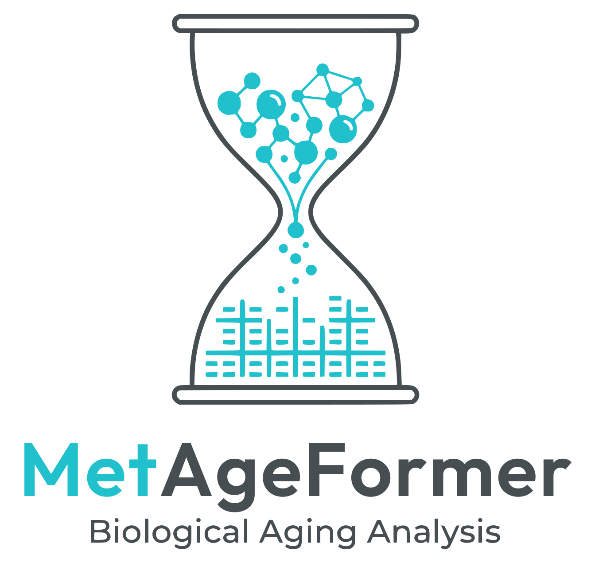

# MetAgeFormer: A metabolomic transformer model for aging clocks and disease risk stratification

[](https://www.apache.org/licenses/LICENSE-2.0)
[](https://www.python.org/downloads/)
[](https://pytorch.org/)

> **[Paper Title]**  
> [Author Names]  
> [Conference/Journal Name, Year]  
> [[Paper]]([PAPER_URL]) | [[Supplementary]]([SUPP_URL]) | [[BibTeX]](#citation)

---

<p align="center">
  
</p>

## 📋 Overview

**MetAgeFormer** is a transformer-based model pre-trained on plasma NMR metabolomics
via masked concentration imputation. This repository releases the **trained model
weights** and **inference code** so anyone can:

- 🧬 extract **metabolomic sample embeddings** from NMR profiles
- ⏳ compute **metabolomic age** and **age acceleration** (DeepGompertz aging clock)
- 🧩 assign **metabolic subtypes** (including meta-subtypes) from sample embeddings
- 🚀 run a **lightweight blood-panel model** (distilled blood-token Transformer) with
  the same aging outputs — no NMR backbone or tokenizer required

All four usage paths are covered by the demo notebooks in [`Notebooks/`](Notebooks/),
which can run on synthetic data without any access-restricted cohort data.

## ✨ Key Features

- **AI-agent support**: bilingual per-capability skill guides (`Docs/SKILL_*.md`) plus
  an agent entry point (`AGENTS.md`) let coding agents (Claude Code, Codex, …)
  install, verify, and run the whole repository autonomously — including raw-data
  preprocessing recipes for UKB / CHARLS / ADNI and private cohorts
- **Bring-your-own-cohort**: published UKB-derived normalization factors
  (`Data/ukb_norm_factors/`, aggregate statistics only) + `Data/apply_ukb_norm.py`
  convert your own NMR or blood-test panel into model input
- **Released weights**: pretrained backbone, DeepGompertz head, and distilled
  lightweight model, downloaded automatically with Git LFS
- **NaN-aware inference**: mask embedding + key-padding mask for missing measurements
  (no zero-fill)
- **Full training pipelines**: pretraining, finetuning, distillation, and ablations
  included, each with a demo run on synthetic data (~1 min, CPU)
- **Demo without restricted data**: `Data/generate_fake_data.py` builds synthetic
  datasets (real schema, randomized values) for the notebooks and training demos

## 🛠️ Installation

Requirements: Python 3.12, PyTorch 2.3.0 (CUDA optional).

```bash
# Clone the repository (model weights are tracked with Git LFS)
git lfs install
git clone https://github.com/ericcombiolab/MetAgeFormer
cd MetAgeFormer

# Create the conda environment (CPU or GPU)
conda env create -f environment_cpu.yml    # CPU
# conda env create -f environment_gpu.yml  # GPU (CUDA 12.1)
conda activate metageformer
```

The environment files contain only the minimal dependency set needed to run the
released models and notebooks (`torch`, `numpy`, `pandas`, `anndata`, `einops`).

## 🚀 Quick Start

```bash
# 1. Generate synthetic demo data (no real data required)
python Data/generate_fake_data.py --synthetic --outdir Data/fake

# 2. Run the demo notebooks (under Notebooks/, see table below)
jupyter notebook Notebooks/1_embedding_extraction.ipynb

# 3. (Optional) run a training demo — pretrain / DeepGompertz finetune /
#    distillation, each ~1 min on CPU; see "Training Pipelines" below
cd Src && export PYTHONPATH=.
python pretrain/train.py --train_config ./pretrain/config/mlmtask_demo.json
```

| Notebook | What it shows |
|----------|---------------|
| [`1_embedding_extraction.ipynb`](Notebooks/1_embedding_extraction.ipynb) | Load the pretrained backbone, extract metabolomic sample embeddings, imputation-style inference |
| [`2_metabolomic_age.ipynb`](Notebooks/2_metabolomic_age.ipynb) | DeepGompertz: metabolomic age, age gap (10-year mortality risk available as an auxiliary output) |
| [`3_metabolic_subtypes.ipynb`](Notebooks/3_metabolic_subtypes.ipynb) | Assign metabolic subtypes (incl. meta-subtypes) from sample embeddings |
| [`4_lightweight_usage.ipynb`](Notebooks/4_lightweight_usage.ipynb) | Distilled blood-token Transformer + DeepGompertz: blood panel → embeddings + age outputs, NaN-safe |

The notebooks resolve the repository root automatically, so they work whether
launched from the repository root or from inside `Notebooks/`.

## 🧪 Training Pipelines

The full pipelines — pretraining, DeepGompertz finetuning, distillation, and
ablations — are included under `Src/`. Every stage ships with a **demo command**
that runs on the synthetic fake data in ~1 minute on CPU; real-data commands are
listed in the same doc. All training outputs go to `artifacts/` (git-ignored),
and `wandb` logging is off by default.

| Stage | Demo command (from `Src/`) |
|-------|----------------------------|
| Pretrain NMR (masked concentration imputation) | `python pretrain/train.py --train_config ./pretrain/config/mlmtask_demo.json` |
| DeepGompertz finetune | `python finetune/deep_gompertz/train.py --data_path ../Data/fake/deep_gompertz_fake --save_dir ../artifacts/demo/checkpoints/finetuned/deep_gompertz/demo --batch_size 32 --n_epoch 3 --baseline_epoch 5 --baseline_n_toler 2 --n_toler 2 --use_wandb false` |
| Distillation | `python distillation/train.py --train_config ./distillation/config/blood_Distill_DeepGompertz_demo.json` |

Full commands (real-data runs, evals on UKB / ADNI / CHARLS, missing-value
simulations, ablations): [`Src/docs/run_examples.md`](Src/docs/run_examples.md).

## 📦 Model Weights

Weights are committed to the repository via **Git LFS** and downloaded automatically
on clone (see [`Model_Weights/readme.md`](Model_Weights/readme.md) for the checkpoint
layout and key contracts):

| Model | Contents | Size |
|-------|----------|------|
| `Model_Weights/MetAgeFormer/` | Pretrained NMR backbone (`config.json`, `tokenizer.pkl`, `model_weights.pth`) | 74 MB |
| `Model_Weights/DeepGompertz/` | Finetuned DeepGompertz survival head | 262 KB |
| `Model_Weights/Lightweight/` | Distilled blood-token Transformer + DeepGompertz (`model_weights.pth`, `model_conf.json`) | 17 MB |
| `Model_Weights/SubtypeClassifier/` | Focal-loss MLP for metabolic subtype assignment (13 clusters → 4 meta-subtypes) | 296 KB |

## 🏗️ Model Architecture

- **Backbone** (`Src/metageformer_torch/models.py`): transformer encoder over a
  107-measure vocabulary-free metabolite token set; checkpoints store keys
  `METAGEFORMER`, `CONCENTRATION_PREDICTOR`, `MULTITASK_HEADS`.
- **DeepGompertz** (`Src/finetune/deep_gompertz/eval_common.py`): neural Gompertz
  baseline aging clock — outputs metabolomic age and age gap (10-year mortality
  risk is also available as an auxiliary output).
- **Lightweight** (`Src/metageformer_torch/models.py`): distilled blood-token
  Transformer + DeepGompertz head, trained with symmetric InfoNCE + Gompertz NLL.

## 📊 Data

Real cohort data (UK Biobank, CHARLS, ADNI, …) is **not included** due to access
restrictions. The notebooks expect AnnData files under `Data/` (see
[`Data/readme.md`](Data/readme.md) for the layout). For demos without restricted
data, `Data/generate_fake_data.py` builds synthetic datasets in two modes:

```bash
# Mode A: mirror the schema of an existing .h5ad (randomized values)
python Data/generate_fake_data.py --from <real.h5ad> --n_samples 1000

# Mode B: synthetic from scratch (no data access needed)
python Data/generate_fake_data.py --synthetic --outdir Data/fake
```

For your own cohort, `Data/apply_ukb_norm.py` applies the published UKB-derived
normalization factors (`Data/ukb_norm_factors/`) to NMR or blood panels. Full
raw-data preprocessing recipes for UKB / CHARLS / ADNI are in
[`Docs/SKILL_DATA_PREPROCESSING.md`](Docs/SKILL_DATA_PREPROCESSING.md); private-cohort
conversion is in [`Docs/SKILL_CUSTOM_COHORT.md`](Docs/SKILL_CUSTOM_COHORT.md).

## 📁 Project Structure

```
├── Src/
│   ├── metageformer_torch/        # Core library: models, tokenizer, checkpoints, masks
│   ├── common/                    # Constants, paths, training helpers, Gompertz baseline
│   ├── pretrain/                  # NMR masked-language-model pretraining (+ configs)
│   ├── finetune/deep_gompertz/    # DeepGompertz finetune + UKB/ADNI eval + inference utilities
│   ├── ablation/                  # End-to-end DeepGompertz ablations (from scratch / fully finetuned)
│   ├── distillation/              # Lightweight blood-token Transformer distillation (+ configs)
│   ├── docs/run_examples.md       # Demo + real-data command examples (no cluster tooling)
│   └── utils.py                   # Tokenizer I/O and helpers
├── Notebooks/                     # Demo notebooks (embeddings / aging clock / subtypes / lightweight)
├── Model_Weights/                 # Released weights (Git LFS; layout in readme.md)
├── Data/                          # Data layout + fake-data generator + UKB norm factors + apply_ukb_norm.py
├── Docs/                          # AI-agent skill guides (setup CN/EN + one skill per capability, incl. data preprocessing)
├── AGENTS.md                      # Entry point for AI agents
├── environment_cpu.yml            # Minimal CPU conda environment
├── environment_gpu.yml            # Minimal GPU conda environment (CUDA 12.1)
├── logo.svg                       # Project logo
├── LICENSE
└── README.md
```

## 📚 Citation

If you use MetAgeFormer in your research, please cite:

```bibtex
@article{...,
  title     = {...},
  author    = {...},
  journal   = {...},
  year      = {...},
  doi       = {...}
}
```

## 📄 License

This project is licensed under the Apache License 2.0 — see [LICENSE](LICENSE) for details.
